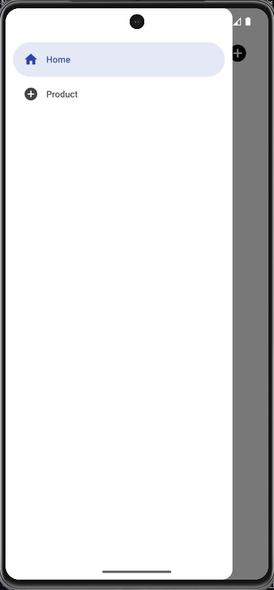

<h1 align="center">React Navigation Concepts</h1>

<p align="center">
  
  
  
  
  
  
  
</p>

<p align="center">
  <a href="#-technologies">Technologies</a>&nbsp;&nbsp;&nbsp;|&nbsp;&nbsp;&nbsp;
  <a href="#-project">Project</a>&nbsp;&nbsp;&nbsp;|&nbsp;&nbsp;&nbsp;
  <a href="#-layout">Layout</a>&nbsp;&nbsp;&nbsp;|&nbsp;&nbsp;&nbsp;
  <a href="#-license">License</a>
</p>

<p align="center">
  
</p>

<br>

<p align="center">
  
</p>

## 🚀 Technologies

This project was developed with the following technologies:

- **Framework**: React Native with Expo
- **Language**: TypeScript
- **Navigation**: React Navigation (Drawer, Bottom Tabs, Stack)
- **Libraries**:
  - `@react-navigation/native`
  - `@react-navigation/drawer`
  - `@react-navigation/bottom-tabs`
  - `@react-navigation/native-stack`
  - `@expo/vector-icons`
  - `react-native-gesture-handler`
  - `react-native-reanimated`
  - `react-native-safe-area-context`
  - `react-native-screens`

## 🚧 Project

This React Native application demonstrates various navigation patterns using React Navigation. It features a drawer-based navigation system with screens for Home and Product views. The app showcases:

- Drawer navigation with custom icons and styling
- Screen navigation with parameters (e.g., product ID)
- Reusable UI components (Header, Title, ButtonIcon)
- TypeScript integration for type-safe navigation

## 🧰 Prerequisites

- Node.js (version 18 or later)
- `npm` or `yarn`

## 💻 How to run

```bash
# Clone the repository
git clone https://github.com/filipebteixeira98/react-navigation.git

# Access the project folder
cd react-navigation

# Install the dependencies
npm install

# Development
# Follow these steps to run the app locally:

1. **Start the Metro Bundler:**
   npm start

2. **Launch on Android:**
   npm run android

3. **Launch on iOS:**
   npm run ios
```

## 🫶 Contributing

Contributions are welcome! Please feel free to submit a Pull Request.

## 📝 License

This project is under the MIT license.

<p align="center">
  Made with ♥ by me
</p>
